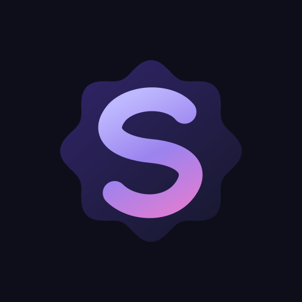

# Omni Studio

<p align="center"></p>

**Agent-Native Creative Suite for Android**

Omni Studio evolves a mature Android video editor into an agent-native creative runtime: humans keep a full manual editor, while trusted Omni agents interact through explicit, inspectable, reversible semantic capabilities instead of brittle screen automation.

> **Status:** foundation / experimental. The inherited editor is substantial; the Omni agent-control surface is intentionally narrow until project and timeline contracts are hardened.

## Vision

```text
User intent
   |
Omni Dev
   |
OmniLink 3
   |
Omni Studio capability layer
   |
Project / Timeline / Media / Intelligence
   |
Command + transaction engine
   |
Media3 / FFmpeg / GPU / on-device ML
```

The long-term goal is **Omni Studio — Agent-Native Creative Suite**: video first, then separable audio, image, captions, asset and automation domains sharing the same project graph and trust model.

## Current foundation

- Android API 26+; compile/target API 37.
- Kotlin 2.4.10 + Jetpack Compose + Material 3.
- Media3 playback, transformation, effects and muxing.
- Source-pinned FFmpegKitNext fallback/native processing.
- Room 3 persistence, Hilt/KSP, WorkManager and baseline profiles.
- ONNX Runtime, MediaPipe and DeepFilterNet integrations inherited from the editor baseline.
- ABI-specific and universal APK output.
- Existing supply-chain, SBOM, release-signing and artifact-verification infrastructure.
- OmniLink 3 first-party integration foundation.
- Signature-protected `OmniStudioExtensionService`.
- Minimal read-only `studio.health` capability.
- CI for unit tests, release lint, optimized release APK assembly, release AAB generation and artifact upload.

## OmniLink 3

Omni Studio targets the [OmniLinkSDK v3.0.0 official release](https://github.com/obieda-hussien/OmniLinkSDK/releases/tag/v3.0.0). The tag resolves to the reviewed 3.0.0 source commit used during the foundation work.

Omni Studio is a first-party Omni capability provider and Agent Gateway client. Same-device privileged integration uses OmniLink's Android Binder surface, requests both `BIND_EXTENSION` and `BIND_AGENT`, protects its exported extension with `BIND_EXTENSION`, and advertises Android 11+ package visibility for both OmniLink service actions.

| Capability | Mode | Risk | Purpose |
|---|---|---:|---|
| `studio.health` | IMMEDIATE | LOW | Report Omni Studio / OmniLink integration status |

The foundation deliberately does **not** expose a generic executor, raw database access, shell access or arbitrary timeline mutation. Same signer establishes identity; it does not grant unlimited authority.

Future mutations must be semantic, revision-aware and transaction-safe:

```text
prepare -> validate -> diff -> preview -> confirm -> commit
                                  \-> rollback
```

Large media is not serialized into Binder JSON. Future media exchange uses bounded references plus content-URI/file-descriptor or OmniLink large-payload/file-transfer mechanisms only when implemented end to end.

## Workspace organization

The editor uses a stable tool rail with adaptive action workbenches, a quieter preview,
and focused settings destinations. See [workspace behavior and verification](docs/WORKSPACE_UX.md).

## Existing editor baseline

The inherited editor already contains production editing systems that Omni Studio will adapt rather than rewrite blindly.

- **Archive Transfer** keeps portable project archives user-controlled and local-first.
- **Timeline interchange:** OpenTimelineIO / FCPXML / EDL export with a **guarded import preview** for incoming timeline files.
- Manual editing remains authoritative; agent APIs will call the same domain operations used by the UI.
- Source media remains non-destructive by default.
- Existing undo/redo, export, proxy, audio, effect and AI tooling stays available while the Omni boundary is introduced incrementally.

### AI / media capability registry

The table below is generated-contract content and intentionally mirrors `scripts/capability_registry.json`.

<!-- capability-registry:ai-tools:begin -->
| Tool | Engine | On-Device? |
|------|--------|------------|
| **Auto Captions** | ONNX Runtime Whisper tiny.en (English; multilingual Sherpa/Whisper path gated) | Yes |
| **Background Removal** | MediaPipe Selfie Segmentation (~1-7MB, ~30fps) | Yes |
| **AI Green Screen** | Planned: RobustVideoMatting requires model integration | Planned |
| **Object Removal** | LaMa-Dilated inpainting with rectangle, ellipse, and freehand mask rendering for stills and motion clips | Yes (explicit ~174 MB model download) |
| **Video Upscaling** | Planned: Real-ESRGAN requires model integration | Planned |
| **Frame Interpolation** | Planned: RIFE v4.6 requires the NCNN dependency | Planned |
| **Style Transfer** | Planned: AnimeGANv2 and Fast NST require model integration | Planned |
| **Stabilization** | Built-in offline motion analysis with bounded translation search and shared preview/export transforms | Yes |
| **Smart Reframe** | MediaPipe BlazeFace detection, EMA-smoothed crop trajectory, 3 strategies (stationary/pan/track) | Yes |
| **Tap-to-Segment** | Planned: SAM 2.1 Hiera Tiny with a MobileSAM fallback | Planned |
| **Scene Detection** | Content-aware frame difference analysis with auto-split | Yes |
| **Auto Color** | Histogram-based brightness/contrast/saturation/temperature | Yes |
| **HDR Encoder Feature Gate** | MediaCodecInfo.CodecCapabilities FEATURE_HdrEditing / FEATURE_HlgEditing | Yes |
| **Motion Tracking** | Template matching with position keyframe generation | Yes |
| **Audio Denoise** | DeepFilterNet 3 with spectral-gate fallback | Yes |
<!-- capability-registry:ai-tools:end -->

## Tech Stack

| Component | Technology |
|-----------|-----------|
| Language | Kotlin 2.4.10 |
| UI | Jetpack Compose + Material 3 |
| Video | Media3 1.11.0 (Transformer + ExoPlayer) |
| Effects | OpenGL ES 3.0 shader/effect pipeline |
| Audio DSP | Custom engine (EQ, compressor, chorus, delay, pitch shift) |
| Speech-to-Text | ONNX Runtime 1.26.0 (Whisper) |
| Noise Reduction | DeepFilterNet 3 (android-deepfilternet 0.0.8) + spectral-gate fallback |
| Beat Detection | Spectral flux onset detection |
| Loudness | EBU R128 / ITU-R BS.1770 measurement |
| Segmentation | MediaPipe Tasks Vision 1.0.0 |
| Animated Titles | Lottie Compose 6.7.1 and Media3 Lottie overlay support |
| Startup performance | AndroidX Baseline Profile / Macrobenchmark 1.5.0-beta01 |
| Database | Room 3.0.1 |
| Settings | DataStore Preferences |
| Architecture | MVVM, single-activity Compose navigation, StateFlow |

## Architecture

```
com.novacut.editor/
├── ai/                     # AI features (captions, scene detect, stabilize, auto-edit)
├── engine/                 # Core engines (78 injectable singletons across 199 files)
│   ├── VideoEngine          # Media3 playback + export
│   ├── AudioEngine          # Waveform extraction + PCM processing
│   ├── AudioEffectsEngine   # DSP chain (EQ, compressor, chorus, etc.)
│   ├── ShaderEffect         # GLSL fragment shader pipeline
│   ├── KeyframeEngine       # Bezier/hold interpolation
│   ├── ProjectAutoSave      # JSON serialization with format versioning
│   ├── ExportService        # Foreground service for background export
│   ├── BeatDetectionEngine  # Spectral flux onset + BPM estimation
│   ├── LoudnessEngine       # EBU R128 measurement + normalization
│   ├── NoiseReductionEngine # DeepFilterNet 3 + spectral-gate fallback
│   ├── FrameInterpolationEngine  # RIFE v4.6 slow-motion (stub)
│   ├── InpaintingEngine     # LaMa object removal
│   ├── UpscaleEngine        # Real-ESRGAN video upscaling (stub)
│   ├── VideoMattingEngine   # RVM AI green screen (stub)
│   ├── StabilizationEngine  # Offline bounded motion analysis and shared transforms
│   ├── StyleTransferEngine  # AnimeGAN + Fast NST (stub)
│   ├── SmartReframeEngine   # Subject-tracking auto-crop
│   ├── TtsEngine            # Android System TTS voiceover synthesis
│   ├── LottieTemplateEngine # Animated title rendering
│   ├── FFmpegEngine         # FFmpegKitNext fallback processing engine
│   ├── SubtitleExporter     # SRT/VTT/ASS subtitle export
│   ├── GenerativeVideoPolicy # Cloud-only trust gates for large video generators
│   ├── TimelineExchangeEngine  # OTIO/FCPXML interchange
│   ├── ProxyWorkflowEngine  # 3-tier media management
│   ├── EditCommand          # Command-pattern undo/redo
│   ├── db/ProjectDatabase   # Room database with migrations
│   ├── whisper/WhisperEngine     # Built-in Whisper (ONNX)
│   ├── whisper/SherpaAsrEngine   # Sherpa-ONNX ASR target metadata + fallback
│   └── segmentation/        # MediaPipe selfie segmentation
├── model/                  # Data classes (Project, Clip, Track, Effect, etc.)
├── ui/
│   ├── editor/             # Main editor
│   ├── export/             # ExportSheet, BatchExportPanel
│   ├── mediapicker/        # MediaPickerSheet
│   ├── projects/           # ProjectListScreen, ProjectTemplateSheet
│   ├── settings/           # SettingsScreen, SettingsViewModel
│   └── theme/              # Compose theme
├── MainActivity.kt         # Single activity and Compose navigation
└── ClearCutApp.kt           # Legacy-named Application class; package migration is deferred
```

The public product name can evolve independently from the inherited source/package names. The OmniLink layer stays thin: it authenticates, authorizes, validates and maps protocol DTOs into domain operations. Editing logic belongs in domain services shared by UI, tests and agents.

Read [docs/ARCHITECTURE.md](docs/ARCHITECTURE.md) for the foundation analysis and [docs/BRANDING.md](docs/BRANDING.md) for the vector icon system, palette and store-artwork contract.

## Agent-native roadmap

Read [docs/ROADMAP.md](docs/ROADMAP.md) for the staged roadmap:

```text
Foundation
   -> Read-only project intelligence
   -> Transactional timeline API
   -> Media intelligence
   -> Semantic editing
   -> Creative skill packs
   -> Omni Creative Graph
   -> Video + Audio + Image + Captions + Assets
   -> Cross-device creative runtime
```

## Build and CI

Requirements:

- JDK 17 for the hosted development gate.
- Android SDK matching compile SDK 37.
- Python for repository verification scripts.

```bash
./gradlew :app:testDebugUnitTest
./gradlew :app:lintDebug
./gradlew :app:assembleDebug
```

Hosted CI builds the optimized/minified **release** APKs and AAB. When the pinned production keystore is not available, CI intentionally emits unsigned release artifacts instead of silently using a debug key. Distribution/signing remains a separate controlled step because the inherited package lineage enforces a pinned certificate.

### Package identity and upgrade policy

**Omni Studio** is the public product name. The Android application ID and source namespace remain intentionally frozen at `com.novacut.editor` during the foundation phase. That legacy technical identity preserves the existing install lineage and access to app-private projects; it is not the public brand.

Keeping the application ID and pinned release certificate allows existing installs to receive in-place updates. Provider authorities remain `${applicationId}.androidx-startup` and `${applicationId}.fileprovider`; the legacy `.clearcut` and `.clearcut-template` archive associations remain recognized for compatibility.

If a future distribution decision requires a different application ID, it must ship as a **new install with an explicit export/import path**. Package migration is therefore a separate migration project, not a cosmetic rename.

The machine-readable contract lives in `scripts/package_identity.json`.

### Dependencies

The generated open-source notice inventory covers redistributable open-source runtime dependencies. OmniLink is first-party source-available software and is documented separately rather than mislabeled as open source.

<!-- capability-registry:dependencies:begin -->
| Dependency | Version | Purpose |
|-----------|---------|---------|
| ONNX Runtime | 1.26.0 | Whisper ASR and LaMa inpainting |
| MediaPipe | 1.0.0 | Selfie segmentation and smart reframe |
| Lottie Compose | 6.7.1 | Animated title templates |
| OkHttp | 5.5.0 | Model downloads and future opt-in provider calls |
| Media3 | 1.11.0 | Transformer, ExoPlayer, effects, and muxing |
| Coil Compose | 3.5.0 | Image and video thumbnails |
| Hilt / Dagger | 2.60.1 | Dependency injection |
| Android DeepFilterNet | 0.0.8 | On-device voiceover noise reduction |
| FFmpegKitNext / FFmpeg | 8.1.0 (FFmpeg 8.1.2) | LGPL FFmpeg paths not covered by Media3 Transformer |
| AndroidX Benchmark/ProfileInstaller | 1.5.0-beta01 / 1.4.1 | Baseline profile generation and installation |
| Sherpa-ONNX | 1.13.2 target | Future native Moonshine v2 ASR path (target) |
| SAM 2.1 ONNX | Targeted | Future tracked-mask path; MobileSAM fallback (target) |
<!-- capability-registry:dependencies:end -->

Omni Studio consumes the official `OmniLinkSDK v3.0.0` release (`com.github.obieda-hussien.OmniLinkSDK:omni-link-sdk:v3.0.0`). The release tag resolves to the reviewed 3.0.0 source commit and CI pins the resulting JitPack artifacts through Gradle dependency verification. Importing the dependency never grants trust; first-party Binder access still depends on the shared signing identity, signature permissions and app policy.

## Security model

- Signature-protected first-party Binder endpoint.
- OmniLink's default same-signer validator remains fail-closed.
- Explicit, narrow capability allowlists.
- No arbitrary command, shell or SQL capability.
- High-impact mutations will use preview/commit and exact confirmation tokens.
- Imported captions, metadata, project files and model-visible content are untrusted data, never agent authority.
- Secrets and private keys stay outside agent-visible payloads.
- Source media is immutable by default.

## Performance direction

Omni Studio is intended to remain useful on constrained Android hardware. Planned agent/media work uses adaptive proxies, bounded ML concurrency, content-addressed analysis caches, hardware codec preference, sparse contact-sheet/frame sampling and device-tier-aware model selection. Final export remains based on source media, not proxy quality.

## Supported devices

- **Min SDK:** 26 (Android 8.0 Oreo)
- **Target SDK:** 37 (Android 17)
- **Required:** OpenGL ES 3.0
- **Recommended:** 4 GB+ RAM for heavier AI features

## Upstream and licensing

Omni Studio is derived from the ClearCut codebase. Preserve all applicable upstream copyright, license and third-party notices. Native FFmpeg and other redistributed dependencies retain their own notice/source-offer requirements.

See `LICENSE`, the in-app third-party notices and `third_party/` for authoritative terms.

---

**Omni Studio — create manually, automate semantically.**
